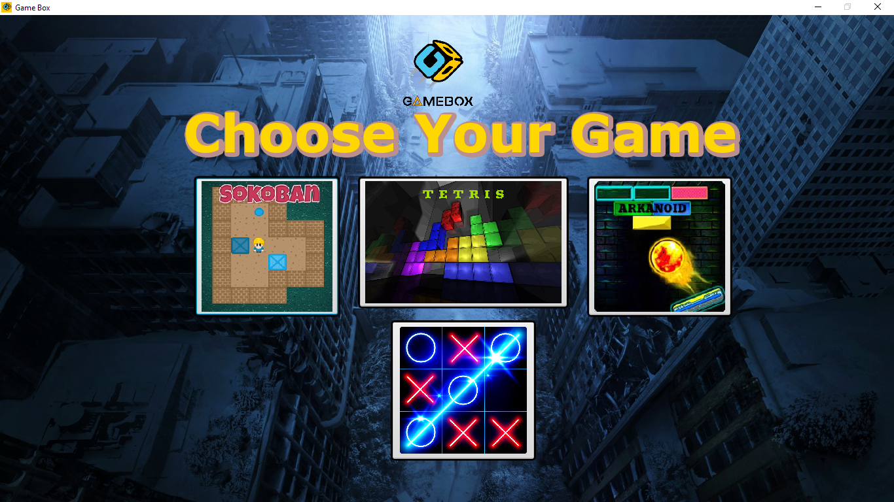
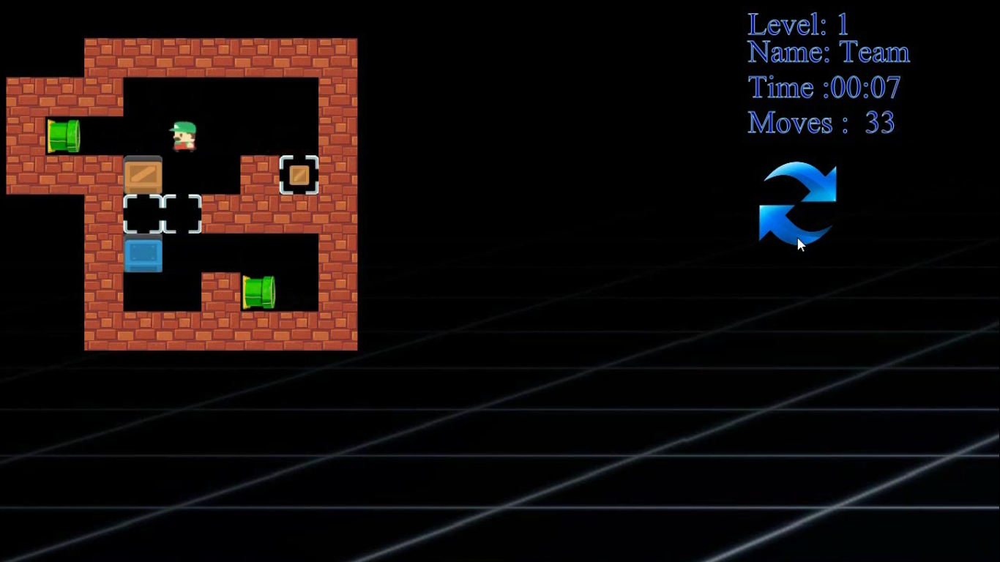
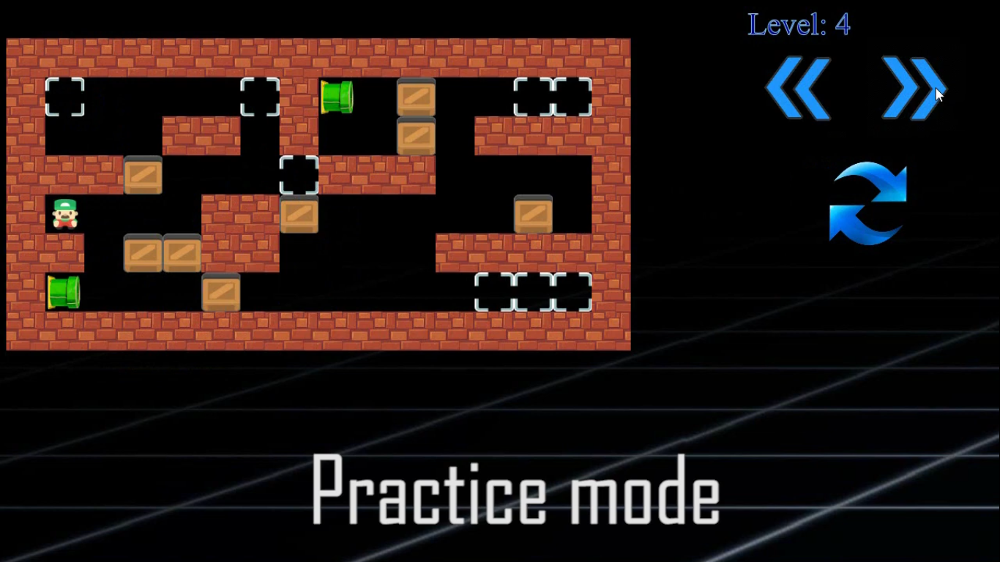
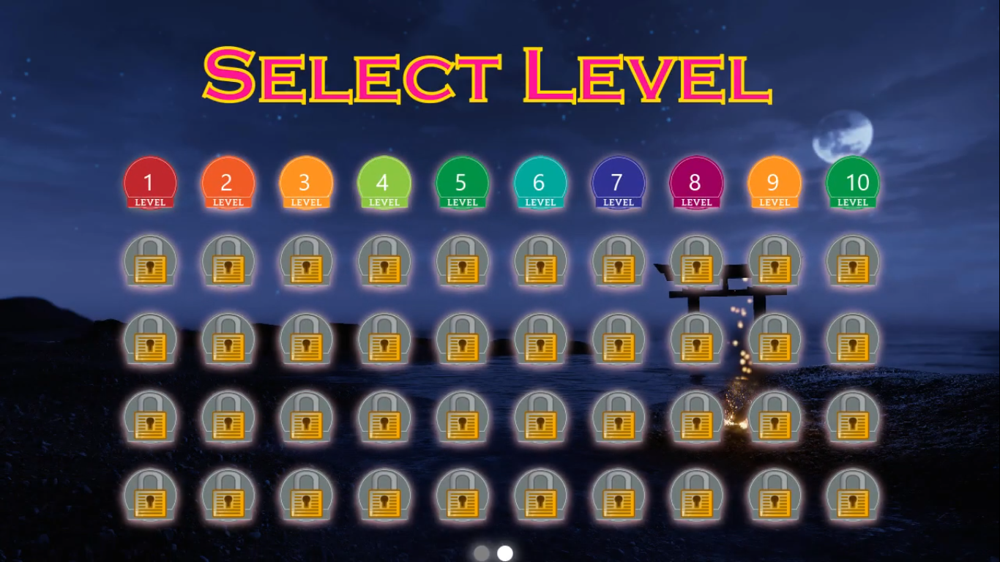
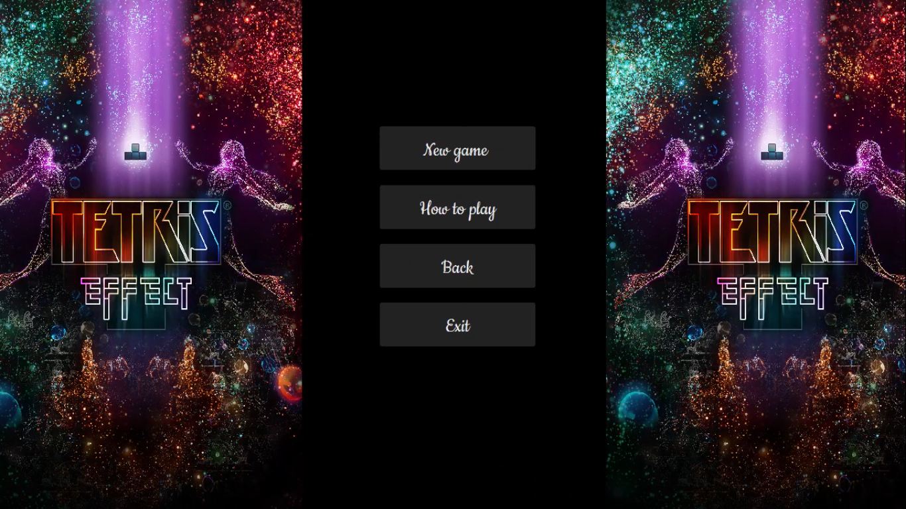
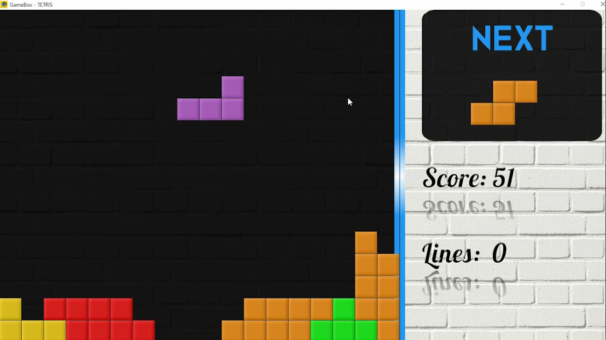
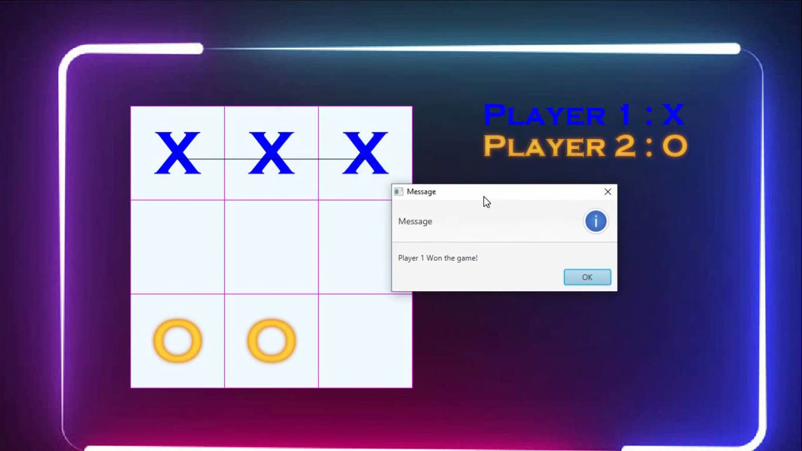
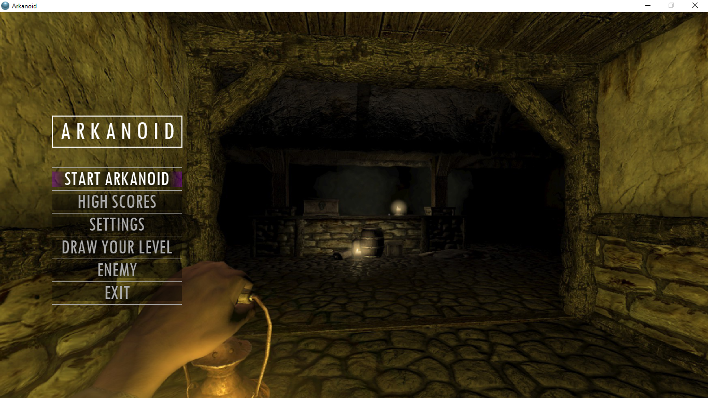
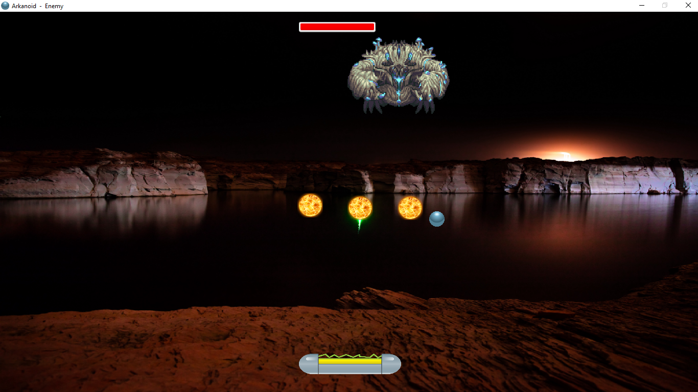
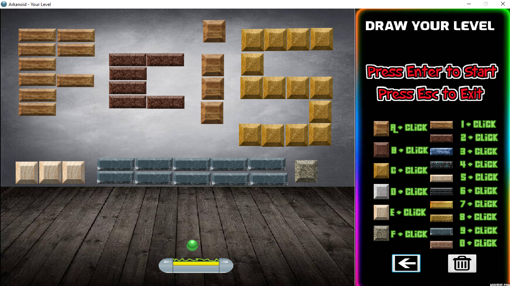

  <a href="https://github.com/Abanoub-Asaad/Game-Box">
    <h1>GameBox</h1>
  </a>
  A desktop application includes four games (Sokoban, Tetris, Arkanoid and AI-XO) that made with Java and JavaFX.

 

- To watch a demo video, Click [here](https://youtu.be/MmQH7oryvQs)
- To view the documentation of the project, Click [here](https://github.com/Abanoub-Asaad/Game-Box/blob/master/Docs/OOP%20Project%20Documentation.pdf)
- To view screenshots, Go below!

 

  
Sokoban

 
 
 

  
Tetris

 
 

  
XO

 

  
Arkanoid

 
 
 
 
 

